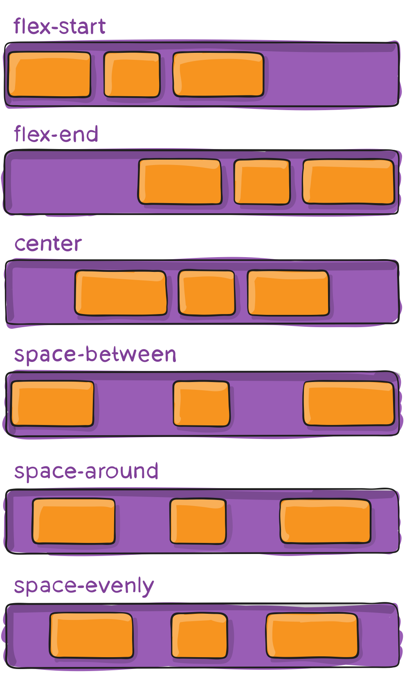
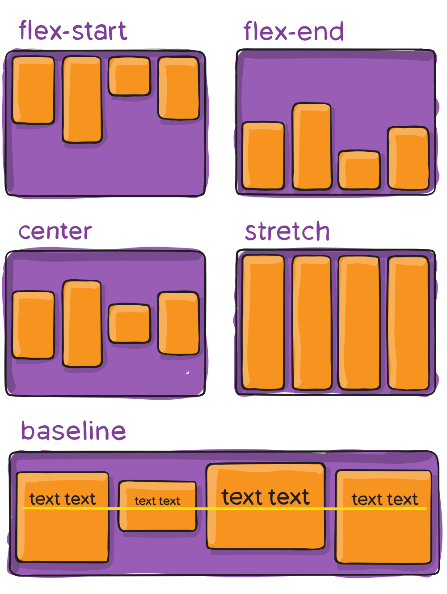

La liste de toutes les propriétés introduites avec Flexbox:

En premier, pour appliquer la  mise en page flexbox, il faut donner cette propriété à l'élément parent:

```
display: flex;
```

À présent, on a accès à toute une série de nouvelles propriétés qui peuvent être appliqués à l'élément parent, ou à un élément enfant.

## Pour l'élément parent

Propriétés pour déterminer le comportement général de la flexbox:

* `flex-direction` : la direction, horizontale ou verticale (`row` ou `column`). Par défaut, cette valeur est horizontale.
* `flex-wrap` : permettre ou non aux éléments de se mettre sur plusieurs lignes (`nowrap` / `wrap` / `wrap-reverse`)
* `flex-flow` : cette propriété combine flex-direction et flex-wrap.

```
.container {
  flex-flow: column wrap;
}
```

### Alignement:

Propriétés s'appliquant sur l'élément parent, pour déterminer l'alignement des enfants:

* `justify-content` : alignement sur l'axe principal (par défaut: horizontal). Valeurs possibles: `flex-start` (valeur par défaut), `flex-end`, `center`, `space-between`, `space-around` et `space-evenly`.
* `align-items` : alignement perpendiculaire à l'axe principal (par défaut: vertical). Valeurs possibles: `stretch` (valeur par défaut), `flex-start`, `flex-end`, `center`, `baseline`.
* `align-content` : définit le comportement si on a plusieurs lignes de flex-items. Mêmes valeurs que `justify-content`, ainsi que `stretch`.





## Pour les éléments enfants

* `order` : permet de donner un chiffre, indiquant sa place.
* `flex-grow` : chiffre sans unité (0 ou 1), permettant de donner son facteur de taille comparé aux autres éléments.
* `flex-shrink` : indique si on autorise l'élément à rétrécir.
* `flex-basis` : taille par défaut de l'élément. Par défaut: `auto`.
* `flex` : propriété qui regroupe `flex-grow`, `flex-shrink` et `flex-basis`. La valeur par défaut est: `0 1 auto`.

* `align-self` : Alignement. Similaire au "align-items" de l'élément parent. Valeurs possibles: `auto`, `flex-start`, `flex-end`, `center`, `baseline`, `stretch`.

## Un exemple

<p class="codepen" data-height="300" data-default-tab="html,result" data-slug-hash="jOZxmyx" data-editable="true" data-user="eracom" style="height: 300px; box-sizing: border-box; display: flex; align-items: center; justify-content: center; border: 2px solid; margin: 1em 0; padding: 1em;">
  <span>See the Pen <a href="https://codepen.io/eracom/pen/jOZxmyx">
  Product Page</a> 
  on <a href="https://codepen.io">CodePen</a>.</span>
</p>
